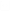
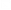
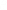
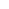
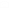
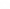

<picture>
  <source media="(prefers-color-scheme: dark)" srcset="/assets/images/logo_dark.svg">
  <source media="(prefers-color-scheme: light)" srcset="/assets/images/logo_bright.svg">
  
</picture>

# ZMK Config for Totem (Slipt Keyboard)

This is a WIP layout based on Colemak DHm for using on macOS (with **en-US International** ANSI layout on host) that includes Spanish accents, and complemented with easy access to development symbols.

---

## Menu

- [Usage](#usage)
  - [Power](#power)
  - [Charging](#charging)
  - [Reset](#reset)
  - [Firmware](#firmware)
  - [Pairing](#pairing)
- [Conventions](#conventions)
- [Layers](#layers)
  - [BAS](#bas)
  - [DEV](#dev)
  - [AXN](#axn)
  - [STG](#stg)
- [About](#about)

---

## Usage Guide

### Power

Your keyboard can be powered by **USB-C cable** or its **built-in battery**.

* **Battery Power:** To turn on battery power, slide the power switch to the **right** on both halves. The two halves will pair automatically.

> The power switch controls battery power only. When connected via USB-C, the keyboard is powered and functions even if the switch is off.

* **Wired Mode:** Connect the left half to your device using a USB-C cable.

* **Wireless (Bluetooth) Mode:** Power on both halves using the battery switch. No cable is needed.

### Charging

To charge a half, ensure its power switch is in the **ON** position, then connect it to a power source (e.g., your computer) via its USB-C port.

### Reset

The reset button offers two functions:

* **Single Press:** Resets the keyboard (power cycles).
* **Double Press (quick):** Puts the keyboard into programming mode. When connected to your computer, it will appear as a USB device, allowing you to drag and drop or copy/paste firmware files for keymap updates.

### Firmware

Your Totem wireless keyboard uses **ZMK firmware**. For in-depth information, customization guides, and keymap creation, refer to the [ZMK documentation](https://zmk.dev/docs), specifically the [customization](https://zmk.dev/docs/customization) and [keymaps](https://zmk.dev/docs/features/keymaps) sections after your initial user setup.

**Updating Firmware:**
To update your keymap, you generally only need to flash the dongle. However, for certain changes or troubleshooting, you may need to flash all of them: dongle, left and right half.

**To flash:**

1.  Turn off the device you intend to flash.
2.  Plug the device into your computer (ensure it's off).
3.  Double-press the reset button quickly.
4.  A new storage device, **XIAO-SENSE**, will appear on your computer. Drag and drop (or copy/paste) the appropriate firmware file (e.g., `totem_dongle-seeduino_xiao_ble-zmk.uf2` for the dongle, `totem_left-seeduino_xiao_ble-zmk.uf2` for the left half, or `totem_right-seeduino_xiao_ble-zmk.uf2` for the right) onto it.
5.  Wait for the storage device to automatically disappear (a few seconds).
6.  Unplug the board.
7.  Follow the [Power](#power) instructions to turn it ON.

**When to flash all devices:**
* If new keymap changes don't take effect after flashing only the left half.
* If you are updating to a new major version of ZMK firmware.
* **If you are experiencing persistent Bluetooth connection issues between the two halves or with your host device.** This is often resolved by ensuring both halves have compatible and up-to-date firmware.

### Bluetooth Connection Troubleshooting (Reset Firmware Shield)

If you are experiencing persistent issues with Bluetooth connections (e.g., halves not pairing, intermittent disconnections, or difficulty connecting to your computer), performing a "settings reset" on all devices can often resolve the problem. This clears all saved Bluetooth profiles and settings.

**To perform a settings reset:**

1.  **Generate the "settings reset" firmware:** You will need to modify your ZMK configuration to build a special "settings reset" `.uf2` file. Refer to the ZMK documentation on "Connection Issues" or "Reset Behaviors" for detailed instructions on how to include the `settings_reset` shield in your `build.yaml` (if using GitHub Actions) or how to build it locally. This will produce a specific `.uf2` file for settings reset.
2.  **Flash the "settings reset" firmware to the dongle:** Follow the "To flash" procedure above, but use the "settings reset" `.uf2` file generated in step 1.
3.  **Flash the "settings reset" firmware to the left half:** Follow the "To flash" procedure above, but use the "settings reset" `.uf2` file generated in step 1.
4.  **Flash the "settings reset" firmware to the right half:** Repeat the "To flash" procedure for the right half, using the "settings reset" `.uf2` file.

### Pairing

The battery widget on the dongle assigns the battery indicators from left to right, based on the sequence in which the keyboard halves are paired to the dongle.

For split keyboards, it is essential to pair the left half first after flashing the dongle, followed by the right half. This ensures the correct mapping of battery status indicators and avoids swapped displays in the widget.

The recommended procedure is as follows:
* Switch off both keyboard halves.
* Flash the dongle
* Disconnect the dongle
* Flash the left half
* Flash the right half
* Reconnect the dongle
* Switch on the left half and wait until the battery indicator appears on the dongle
* Switch on the right half

> If the dongle has already been paired with both keyboard halves and the battery widget displays swapped indicators (i.e., the left battery indicator refers to the right keyboard half), a full reset of the dongle is required.

---

## Conventions

### Icons

Icons used to describe some modifiers and actions

| Label        | Description                                                  |
| :----------: | ------------------------------------------------------------ |
| <kbd>⌘</kbd> | Command                                                      |
| <kbd>⌃</kbd> | Control                                                      |
| <kbd>⌥</kbd> | Alt                                                          |
| <kbd>⇧</kbd> | Shift                                                        |
| <kbd>🄰</kbd> | Caps Lock                                                    |
| <kbd>⎋</kbd> | Esc                                                          |
| <kbd>↹</kbd> | Tab                                                          |
| <kbd>⏎</kbd> | Return                                                       |
| <kbd>␣</kbd> | Space                                                        |
| <kbd>⇪</kbd> | [Hold Tap](https://zmk.dev/docs/behaviors/hold-tap#hold-tap) |

⇧ [Back to menu](#menu)

---

## Layers

### BAS

Letters, accents for Spanish language and quick shortcuts for most used symbols to "avoid" changing layers.

#### Spanish

| Label        | Shortcut                                |
| :----------: | --------------------------------------: |
| <kbd>á</kbd> | <kbd>⌥</kbd>+<kbd>a</kbd>               |
| <kbd>Á</kbd> | <kbd>⇧</kbd>+<kbd>⌥</kbd>+<kbd>a</kbd>  |
| <kbd>é</kbd> | <kbd>⌥</kbd>+<kbd>e</kbd>               |
| <kbd>É</kbd> | <kbd>⇧</kbd>+<kbd>⌥</kbd>+<kbd>e</kbd>  |
| <kbd>í</kbd> | <kbd>⌥</kbd>+<kbd>i</kbd>               |
| <kbd>Í</kbd> | <kbd>⇧</kbd>+<kbd>⌥</kbd>+<kbd>i</kbd>  |
| <kbd>ó</kbd> | <kbd>⌥</kbd>+<kbd>o</kbd>               |
| <kbd>Ó</kbd> | <kbd>⇧</kbd>+<kbd>⌥</kbd>+<kbd>o</kbd>  |
| <kbd>ú</kbd> | <kbd>⌥</kbd>+<kbd>u</kbd>               |
| <kbd>Ú</kbd> | <kbd>⇧</kbd>+<kbd>⌥</kbd>+<kbd>u</kbd>  |
| <kbd>ü</kbd> | <kbd>^</kbd>+<kbd>u</kbd>               |
| <kbd>Ü</kbd> | <kbd>⇧</kbd>+<kbd>^</kbd>+<kbd>u</kbd>  |
| <kbd>ñ</kbd> | <kbd>⌥</kbd>+<kbd>n</kbd>               |
| <kbd>Ñ</kbd> | <kbd>⇧</kbd>+<kbd>⌥</kbd>+<kbd>n</kbd>  |

### Text

| Label          | Shortcut                    | Actions                                               |
| -------------: | --------------------------: | ----------------------------------------------------- |
| <kbd>⌫</kbd>   |                             | Backspace                                             |
| <kbd>⌫</kbd>   | <kbd>⌥</kbd>+<kbd>⌫</kbd>   | Delete word backward                                  |
| <kbd>⌫</kbd>   | <kbd>⌘</kbd>+<kbd>⌫</kbd>   | Delete until beginning                                |
| <kbd>⌦</kbd>   |                             | Delete                                                |
| <kbd>⌦</kbd>   | <kbd>⌥</kbd>+<kbd>⌦</kbd>   | Delete word forward                                   |
| <kbd>⌦</kbd>   | <kbd>⌘</kbd>+<kbd>⌦</kbd>   | Delete until end                                      |
| <kbd>▷</kbd>   |                             | Left (terminal autocompletion)                        |
| <kbd>🄰</kbd>  | <kbd>⇧</kbd>+<kbd>⎋</kbd>   | Caps lock                                             |

### Files

| Label        | Shortcut                                | Actions                 |
| -----------: | --------------------------------------: | ----------------------- |
| <kbd>⌫</kbd> | <kbd>⌘</kbd>+<kbd>⌫</kbd>               | Move to trash           |
| <kbd>⌫</kbd> | <kbd>⌘</kbd>+<kbd>⌥</kbd>+<kbd>⌫</kbd>  | Delete file permanently |

⇧ [Back to menu](#menu)

### DEV

Symbols and dev shortcuts for JS/TS.

#### Symbols

| Label        | Shortcut                   |
| :----------: | -------------------------: |
| <kbd>°</kbd> | <kbd>⌥</kbd>+<kbd>#</kbd>  |
| <kbd>€</kbd> | <kbd>⌥</kbd>+<kbd>$</kbd>  |
| <kbd>«</kbd> | <kbd>⌥</kbd>+<kbd>[</kbd>  |
| <kbd>»</kbd> | <kbd>⌥</kbd>+<kbd>]</kbd>  |
| <kbd>¡</kbd> | <kbd>⌥</kbd>+<kbd>!</kbd>  |
| <kbd>¿</kbd> | <kbd>⌥</kbd>+<kbd>?</kbd>  |

#### Browser DevTools

| Label                                                                         | Shortcut                                                                       | Action                     |
| ----------------------------------------------------------------------------: | -----------------------------------------------------------------------------: | -------------------------- |
| <kbd></kbd>             |                                                                                | Refresh                    |
| <kbd></kbd> | <kbd>⇧</kbd>+<kbd></kbd> | Hard refresh (clean cache) |
| <kbd></kbd>                       |                                                                                | Open DevTools              |

#### IDE

| Label                                                             | Shortcut                                                           | Action                      |
| ----------------------------------------------------------------: | -----------------------------------------------------------------: | --------------------------- |
| <kbd></kbd>       |                                                                    | Cursor: Add to Chat         |
| <kbd></kbd>     |                                                                    | Cursor: Quick Edit          |
| <kbd>//</kbd>                                                     |                                                                    | Toggle line comment         |
| <kbd>/\* \*/</kbd>                                                |                                                                    | Toggle block comment        |
| <kbd></kbd>             |                                                                    | Open Terminal               |
| <kbd></kbd>   | <kbd>⇧</kbd>+<kbd></kbd> | Open New Terminal           |
| <kbd></kbd> | <kbd>⌥</kbd>+<kbd></kbd> | Max/Min Terminal            |

⇧ [Back to menu](#menu)

### AXN

Quick navigation actions and numbers. Function keys works independently as a sub-layer to avoid shortcuts collisions.

#### Navigation

| Label         | Action                |
| ------------: | --------------------- |
| <kbd>△</kbd>  | Up                    |
| <kbd>▽</kbd>  | Down                  |
| <kbd>◁</kbd>  | Left                  |
| <kbd>▷</kbd>  | Right                 |
| <kbd>⇤</kbd>  | Home                  |
| <kbd>⇥</kbd>  | End                   |
| <kbd>⇞</kbd>  | Page up               |
| <kbd>⇟</kbd>  | Page down             |
| <kbd>⇺</kbd>  | Prev Tab              |
| <kbd>⇻</kbd>  | Next Tab              |

#### Actions

| Label                                                                | Shortcut                                                     | Action               |
| -------------------------------------------------------------------: | -----------------------------------------------------------: | -------------------- |
| <kbd><\|</kbd>                                                       |                                                              | Expand selection     |
| <kbd>\|></kbd>                                                       |                                                              | Shrink selection     |
| <kbd>↶</kbd>                                                         |                                                              | Undo                 |
| <kbd>↷</kbd>                                                         |                                                              | Redo                 |
| <kbd></kbd>                          |                                                              | Cut                  |
| <kbd></kbd>                        |                                                              | Copy                 |
| <kbd></kbd>                      |                                                              | Paste                |
| <kbd></kbd> | <kbd>⇧</kbd>+<kbd></kbd> | Paste without format |
| <kbd></kbd>                        |                                                              | Find                 |
| <kbd></kbd>                  |                                                              | Replace              |

⇧ [Back to menu](#menu)

### STG

Dedicated to Bluetooth and media controls.

#### Actions

| Label                                                                       | Shortcut                                                                 | Action                           |
| --------------------------------------------------------------------------: | -----------------------------------------------------------------------: |  ------------------------------- |
| <kbd></kbd>                     |                                                                          | Jump to #️⃣ device                |   
| <kbd></kbd>                   |                                                                          | ZMK Studio                       |
| <kbd></kbd>       | <kbd>⇧</kbd>+<kbd></kbd>   | Clear Current Bluetooth          |
| <kbd></kbd>               | <kbd>⌥</kbd>+<kbd></kbd>   | Clear All Bluetooth              |
| <kbd></kbd>                         |                                                                          | Zoom in                          |
| <kbd></kbd>                   |                                                                          | Zoom reset                       |
| <kbd></kbd>                   | <kbd>⇧</kbd>+<kbd></kbd>   | Zoom reset IDE                   |
| <kbd></kbd>                       |                                                                          | Zoom out                         |
| <kbd></kbd>                     |                                                                          | Bright down                      |
| <kbd></kbd>                 |                                                                          | Bright up                        |
| <kbd></kbd>                     | <kbd>⌥</kbd>+<kbd></kbd>     | Dongle Bright down               |
| <kbd></kbd>                 | <kbd>⌥</kbd>+<kbd></kbd> | Dongle Bright up                 |
| <kbd></kbd>           |                                                                          | Application Window               |
| <kbd></kbd> |                                                                          | Mission Control                  |
| <kbd></kbd>                   |                                                                          | Switch to USB                    |
| <kbd></kbd>             |                                                                          | Toggle between Bluethoot and USB |
| <kbd></kbd>                     |                                                                          | Switch to Bluethoot              |

#### Tools

| Label                                                                | Shortcut                                                                 | Action                        |
| -------------------------------------------------------------------: | -----------------------------------------------------------------------: |  ---------------------------- |
| <kbd></kbd>          |                                                                          | Show Color Picker             |
| <kbd></kbd>        | <kbd>⌥</kbd>+<kbd></kbd> | Pick a color                  |
| <kbd></kbd>            |                                                                          | Capture screenshot options    |
| <kbd></kbd> | <kbd>⇧</kbd>+<kbd></kbd>   | Capture of selected area      |
| <kbd></kbd>  | <kbd>⌥</kbd>+<kbd></kbd>   | Capture with teampaper        |
| <kbd></kbd>                |                                                                          | Finder (File Explorer)        |
| <kbd></kbd>                | <kbd>⌥</kbd>+<kbd></kbd>       | Show/hide system files        |

> [!NOTE]
> Combine `^` with `⇧` or `⌥` for sending the screenshoot to the clipboard instead of saving it to a file.

#### Media

| Label                                                 | Shortcut                                                           | Action       |
| ----------------------------------------------------: | -----------------------------------------------------------------: | ------------ |
| <kbd></kbd>     |                                                                    | Volume up    |
| <kbd></kbd> |                                                                    | Volume Mute  |
| <kbd></kbd> | <kbd>⌥</kbd>+<kbd></kbd> | Mic Mute     |
| <kbd></kbd> |                                                                    | Volume down  |

#### IDE

| Label                                                   | Action |
| ------------------------------------------------------: | ------ |
| <kbd></kbd>   | Home   |
| <kbd></kbd>     | Git    |
| <kbd></kbd> | Debug  |
| <kbd></kbd>   | ToDo   |

#### MacOS

| Label                                                                   | Action             |
| ----------------------------------------------------------------------: | ------------------ |
| <kbd></kbd> | Mission Control    |
| <kbd></kbd>           | Application Window |

⇧ [Back to menu](#menu)

---

## About

### Hardware

- [Totem Split Keyboard](https://github.com/GEIGEIGEIST/TOTEM)
- [Prospector Dongle](https://github.com/carrefinho/prospector)

### Fork

- [zmk-config-totem](https://github.com/GEIGEIGEIST/zmk-config-totem) - ZMK GEIGEIGEIST layout
- [zmk-dongle-screen](https://github.com/janpfischer/zmk-dongle-screen) - ZMK Dongle Screen YADS (Yet another Dongle Screen)

### Built With

- [VS Code](https://code.visualstudio.com/) - Code editing redefined.
- [ZMK Docs](https://zmk.dev/docs) - Modern, open source keyboard firmware
- [ZMK physical layouts converter](https://zmk-physical-layout-converter.streamlit.app/) - Tool to convert and visualize physical layout representations for ZMK Studio
- [Figma](https://www.figma.com/) - The collaborative interface design tool

### Tools

- (ColorSlurp)[https://apps.apple.com/us/app/colorslurp/id1287239339]
- (Teampaper)[https://apps.apple.com/us/app/teampaper-screen-capture-tool/id1199502670?mt=12]
- (MuteKey)[https://apps.apple.com/us/app/mutekey/id1509590766?mt=12]
- (Rectangle)[https://rectangleapp.com/]

### Typing

- [Colemak Club](https://gnusenpai.net/colemakclub/) - Learn Colemak Layout
- [Monkeytype](https://monkeytype.com/) - A minimalistic typing test, featuring many test modes, an account system to save your typing speed history and user configurable features like themes, a smooth caret and more.
- [Typ.ing](https://typ.ing/) - a typing trainer by [zsa.io](https://www.zsa.io/)

### Versioning

We use [SemVer](http://semver.org/) for versioning. For the versions available, see the [totem-zmk-config](https://github.com/deintech/totem-zmk-config/tags) on GitHub.

### Authors

- **Camilo Martinez** [[Equiman](http://github.com/equiman)]

### License

This project is licensed under the MIT License - see the [LICENSE](LICENSE.md) file for details.

⇧ [Back to menu](#menu)
